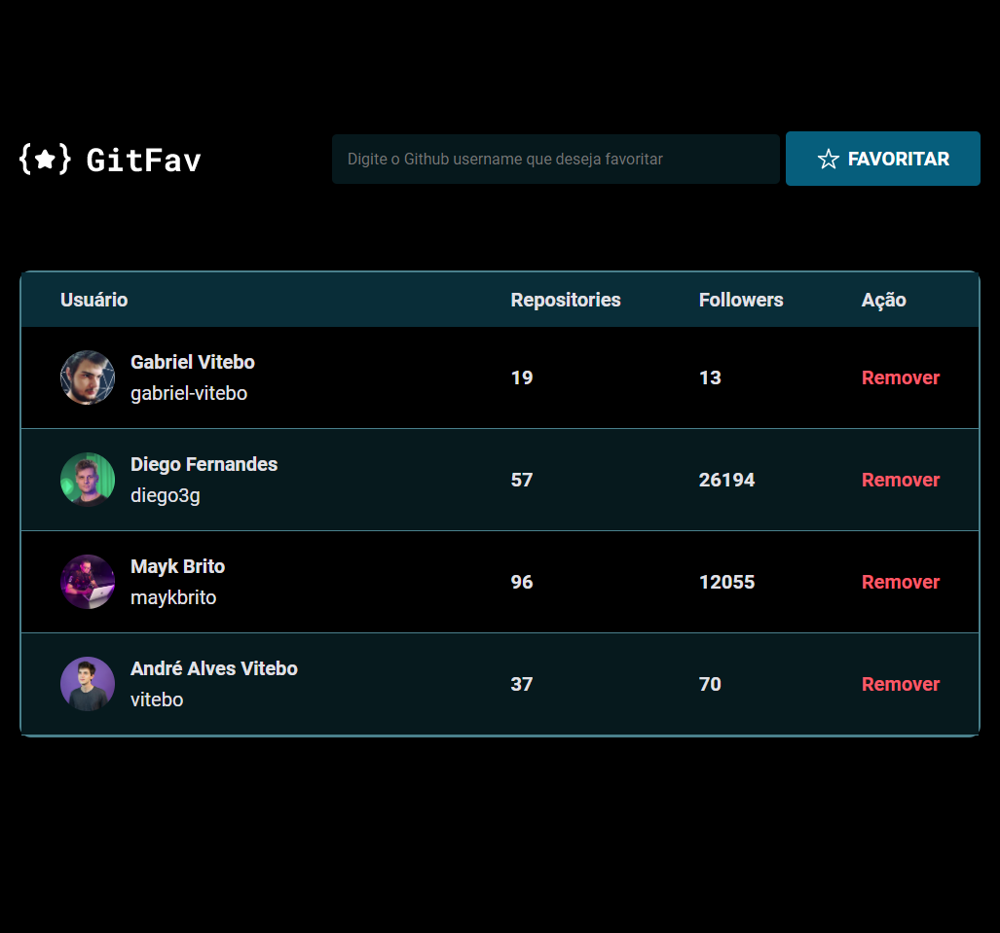

<h1 align="center">✨GitFav✨</h1>

  Desafio proposto pela Rocketseat e realizado com sucesso

  

## 💻 Projeto
[Clique aqui!](https://gabriel-vitebo.github.io/git-fav/)

Desenvolvi um projeto para adicionar e salvar seus perfis favoritos do github, clique no link acima, escreva o nome do usuário que deseja adicionar aos seus favoritos, e pronto! 😁😊 

## 🚀 Tecnologias

💻 Esse projeto foi desenvolvido com as seguintes tecnologias:

- HTML e CSS
- JavaScript

## O que aprendi 🎉✔

- Classes e Herança no JS
- Imutabilidade
- localStorage
- Promessas com Async Await
- try, catch e throw

## Contato 💌
- vitebo@outlook.com